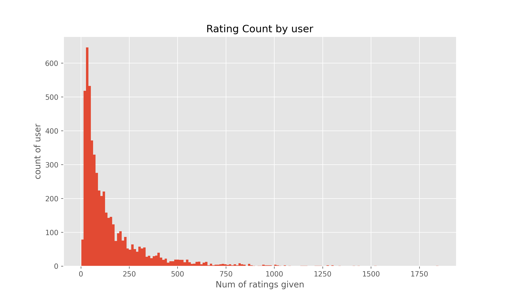
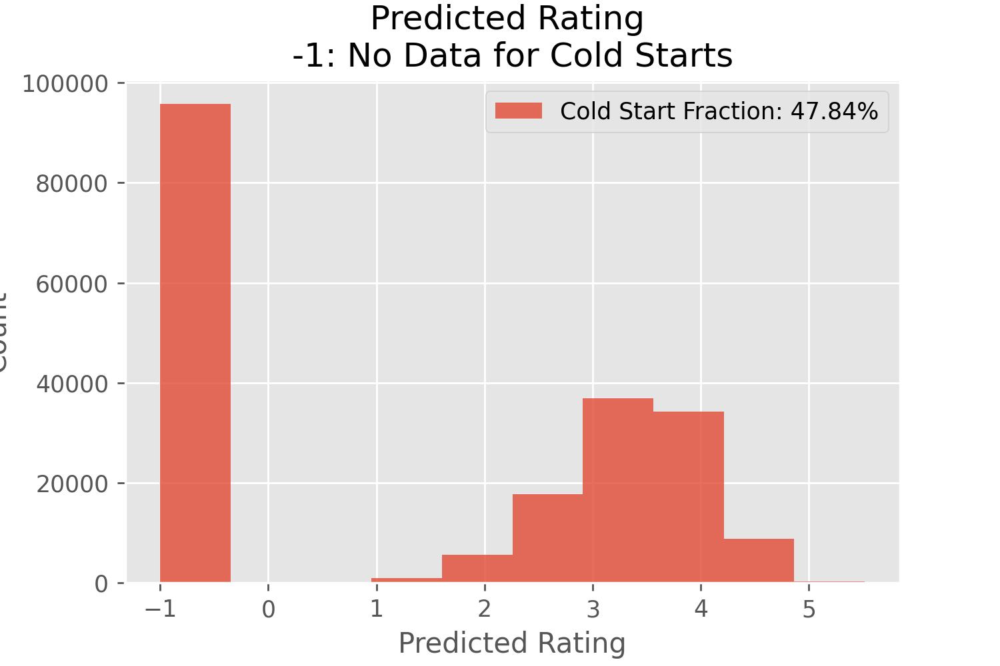
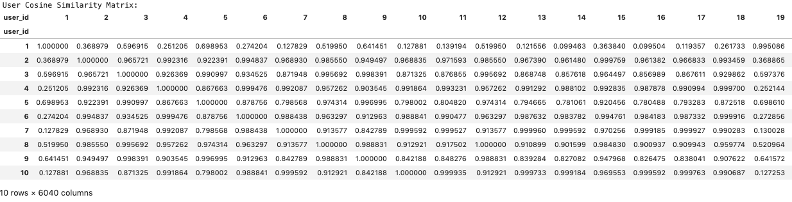
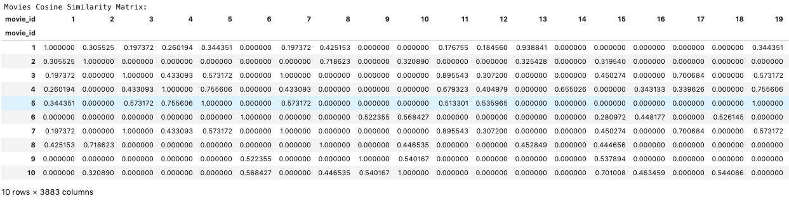

# Recommender Case Study

<a href="https://github.com/cwong90">Cindy Wong</a> | <a href="https://github.com/rasbot">Nathan Rasmussen</a> | <a href="https://github.com/mkpetterson">Maureen Petterson</a>

## Table of Contents

- <a href="https://github.com/mkpetterson/recommender_study#introduction">Introduction</a>  
- <a href="https://github.com/mkpetterson/recommender_study#data-preparation-and-exploratory-data-analysis">Data Preparation and Exploratory Data Analysis</a> 
- <a href="https://github.com/mkpetterson/recommender_study#modeling-linear-regression">Statistical Analysis</a>  
- <a href="https://github.com/mkpetterson/recommender_study#prediction-results">Prediction Results</a> 
- <a href="https://github.com/mkpetterson/recommender_study#conclusion">Conclusion</a>
- <a href="https://github.com/mkpetterson/recommender_study#notes">Notes</a>

## Introduction

No one wants to waste their time watching movies and tv shows they don't enjoy, but there are so many options for what movies to watch that consumers can struggle to make a decision. 
Companies are eager to pull in users and generate more revenue and relatively newer players such as Netflix and Amazon have started producing their own movies and tv shows. Competition for attention is fierce and more sophisticated technology is leading the way in both giving consumers what they want and in shaping shaping their tastes. Recommender systems are the basis of Netflix, a company that has been wildly successful in amassing a large subscription due to their tailored suggestions and high quality programs (well, compared to reality television).

We have built a movie recommender system based off of 800,000 reviews given by nearly 5400 users. The data comes from the [MovieLens dataset](http://grouplens.org/datasets/movielens/) and it includes movie information, user information, and the users' ratings. 

## Data Preparation and Exploratory Data Analysis

The data did not require any cleaning prior to use, however we did have several different datasets that needed to be linked together to get final recommendations. 

<b>Training Data</b> 
The training data contained a combined 800,000 reviews. Overall, there were 3662 movies reviewed and 5399 unique users. Most of the users rated over 1000 movies, but the majority rated fewer than 100. A breakdown of the count can be shown in the plot below.

<b>Movie Data</b> 
The movie data contains the movie id, title, and genre descriptions. The descriptions are:

	* Action
	* Adventure
	* Animation
	* Children's
	* Comedy
	* Crime
	* Documentary
	* Drama
	* Fantasy
	* Film-Noir
	* Horror
	* Musical
	* Mystery
	* Romance
	* Sci-Fi
	* Thriller
	* War
	* Western

<b>User Data</b> 
The user data contains user id, gender, age, occupation, and zip code. The age and occupation columns are categorical and represent age groups and occupation groups. 

Age 

 	*  1:  "Under 18"
	* 18:  "18-24"
	* 25:  "25-34"
	* 35:  "35-44"
	* 45:  "45-49"
	* 50:  "50-55"
	* 56:  "56+"

Occupation 

	*  0:  "other" or not specified
	*  1:  "academic/educator"
	*  2:  "artist"
	*  3:  "clerical/admin"
	*  4:  "college/grad student"
	*  5:  "customer service"
	*  6:  "doctor/health care"
	*  7:  "executive/managerial"
	*  8:  "farmer"
	*  9:  "homemaker"
	* 10:  "K-12 student"
	* 11:  "lawyer"
	* 12:  "programmer"
	* 13:  "retired"
	* 14:  "sales/marketing"
	* 15:  "scientist"
	* 16:  "self-employed"
	* 17:  "technician/engineer"
	* 18:  "tradesman/craftsman"
	* 19:  "unemployed"
	* 20:  "writer"

- cold starts by count
- ratings given by users
- stats on training and request data
- screenshots of movie and user demographic data

<b>Request Data</b> 
We were given a file with 200,000 user movie pairs and our task is to predict the rating each user would give the movie. Several of the users in the request file were not present in the training file, meaning we had no information on what movies they had previous watched and what their subjective ratings were. This problem of trying to give ratings to a user with no information is called the "cold start problem". 

The histogram below shows the predicted ratings of all the user/movie pairs; the values of -1 indicate users for which we initially had no suggested rating. The methods of dealing with this are discussed in the Statistical Analysis section. 

## Statistical Analysis

The basis of recommender systems is assigning latent features to both movies and users. Each user has particular movies and genres they prefer, and those preferences are encoded in the latent feature values. Similarly, each movie is stronger or weaker on certain topics or genres, and those differences will be reflected in their latent scores. 

We used Spark ALS as the basis for our recommender model. Training the model on the training data allowed us to extract laten features for all the users and movies in the training data. We then could predict each user-movie pair by computing the dot product of the user latent feature vector with the movie latent feature vector. 

We split our training data up into a training and cross validation set in order to tune hyperparameters and pick an optimal error metric for assessing our recommender.

### Finding Similarities for Users and Movies

In order to computer the dot product of the user latent feature vector with the movie latent feature vector, we need to have those features. However, when a movie or user doesn't exist, we need another way of obtain those latent features.

We approached this problem by calculating the cosine similarity between the non-existent user/movie and existing ones. We set a threshold of who/what the top similar users/movies are and calculated the average of their latent features. 

    

        <b>Users Cosine Similarity Matrix</b>  
    

    

    

        <b>Movies Cosine Similarity Matrix</b>  
    

    

## Prediction Results

## Conclusion

